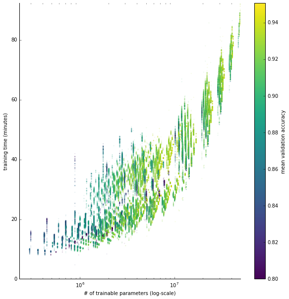

# NASBench: A Neural Architecture Search Dataset and Benchmark

This repository contains the code used for generating and interacting with the
NASBench dataset. The dataset contains **423,624 unique neural networks**
exhaustively generated and evaluated from a fixed graph-based search space.

Each network is trained and evaluated multiple times on CIFAR-10 at various
training budgets and we present the metrics in a queriable API. The current
release contains over **5 million** trained and evaluated models.

Our paper can be found at:

[NAS-Bench-101: Towards Reproducible Neural Architecture
Search](https://arxiv.org/abs/1902.09635)

If you use this dataset, please cite:

```
@InProceedings{pmlr-v97-ying19a,
    title =     {{NAS}-Bench-101: Towards Reproducible Neural Architecture Search},
    author =    {Ying, Chris and Klein, Aaron and Christiansen, Eric and Real, Esteban and Murphy, Kevin and Hutter, Frank},
    booktitle = {Proceedings of the 36th International Conference on Machine Learning},
    pages =     {7105--7114},
    year =      {2019},
    editor =    {Chaudhuri, Kamalika and Salakhutdinov, Ruslan},
    volume =    {97},
    series =    {Proceedings of Machine Learning Research},
    address =   {Long Beach, California, USA},
    month =     {09--15 Jun},
    publisher = {PMLR},
    url =       {http://proceedings.mlr.press/v97/ying19a.html},
```

## Dataset overview

NASBench is a tabular dataset which maps convolutional neural network
architectures to their trained and evaluated performance on CIFAR-10.
Specifically, all networks share the same network "skeleton", which can be seen
in Figure (a) below. What changes between different models is the "module", which is a
collection of neural network operations linked in an arbitrary graph-like
structure.

Modules are represented by directed acyclic graphs with up to 9 vertices and 7
edges. The valid operations at each vertex are "3x3 convolution", "1x1
convolution", and "3x3 max-pooling". Figure (b) below shows an Inception-like
cell within the dataset. Figure (c) shows a high-level overview of how the
interior filter counts of each module are computed.


There are exactly 423,624 computationally unique modules within this search
space and each one has been trained for 4, 12, 36, and 108 epochs three times
each (423K * 3 * 4 = ~5M total trained models). We report the following metrics:

* training accuracy
* validation accuracy
* testing accuracy
* number of parameters
* training time

The scatterplot below shows a comparison of number of parameters, training time,
and mean validation accuracy of models trained for 108 epochs in the dataset.



See our paper for more detailed information about the design of this search
space, further implementation details, and more in-depth analysis.

## Colab

You can directly use this dataset from Google Colaboratory without needing to
install anything on your local machine. Click "Open in Colab" below:

[](https://colab.research.google.com/github/google-research/nasbench/blob/master/NASBench.ipynb)

## Setup

1.  Clone this repo.

```
git clone https://github.com/google-research/nasbench
cd nasbench
```

2. (optional) Create a virtualenv for this library.

```
virtualenv venv
source venv/bin/activate
```

3. Install the project along with dependencies.

```
pip install -e .
```

**Note:** the only required dependency is TensorFlow. The above instructions
will install the CPU version of TensorFlow to the virtualenv. For other install
options, see https://www.tensorflow.org/install/.

## Download the dataset

The full dataset (which includes all 5M data points at all 4 epoch lengths):

https://storage.googleapis.com/nasbench/nasbench_full.tfrecord

Size: ~1.95 GB, SHA256: `3d64db8180fb1b0207212f9032205064312b6907a3bbc81eabea10db2f5c7e9c`

---

Subset of the dataset with only models trained at 108 epochs:

https://storage.googleapis.com/nasbench/nasbench_only108.tfrecord

Size: ~499 MB, SHA256: `4c39c3936e36a85269881d659e44e61a245babcb72cb374eacacf75d0e5f4fd1`


## Using the dataset

Example usage (see `example.py` for a full runnable example):

```python
# Load the data from file (this will take some time)
nasbench = api.NASBench('/path/to/nasbench.tfrecord')

# Create an Inception-like module (5x5 convolution replaced with two 3x3
# convolutions).
model_spec = api.ModelSpec(
    # Adjacency matrix of the module
    matrix=[[0, 1, 1, 1, 0, 1, 0],    # input layer
            [0, 0, 0, 0, 0, 0, 1],    # 1x1 conv
            [0, 0, 0, 0, 0, 0, 1],    # 3x3 conv
            [0, 0, 0, 0, 1, 0, 0],    # 5x5 conv (replaced by two 3x3's)
            [0, 0, 0, 0, 0, 0, 1],    # 5x5 conv (replaced by two 3x3's)
            [0, 0, 0, 0, 0, 0, 1],    # 3x3 max-pool
            [0, 0, 0, 0, 0, 0, 0]],   # output layer
    # Operations at the vertices of the module, matches order of matrix
    ops=[INPUT, CONV1X1, CONV3X3, CONV3X3, CONV3X3, MAXPOOL3X3, OUTPUT])

# Query this model from dataset, returns a dictionary containing the metrics
# associated with this model.
data = nasbench.query(model_spec)
```

See `nasbench/api.py` for more information, including the constraints on valid
module matrices and operations.

**Note**: it is not required to use `nasbench/api.py` to work with this dataset,
you can see how to parse the dataset files from the initializer inside
`nasbench/api.py` and then interact the data however you'd like.

## How the dataset was generated

The dataset generation code is provided for reference, but the dataset has
already been fully generated.

The list of unique computation graphs evaluated in this dataset was generated
via `nasbench/scripts/generate_graphs.py`. Each of these graphs was evaluated
multiple times via `nasbench/scripts/run_evaluation.py`.

## How to run the unit tests

Unit tests are included for some of the algorithmically complex parts of the
code. The tests can be run directly via Python. Example:

```
python nasbench/tests/model_builder_test.py
```

## Disclaimer

This is not an official Google product.
